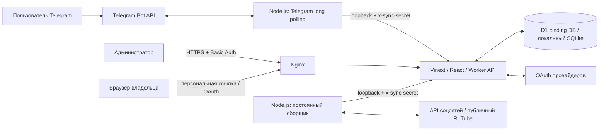

# Контент-завод

Telegram-бот и веб-панель для учёта каналов креаторов, работы продюсерских команд и сбора статистики YouTube, RuTube, VK, Instagram, Threads и TikTok. Пользователь добавляет ссылку на свой канал, при необходимости подключает аккаунт через официальный вход и получает показатели вместе со статусом и временем обновления. Администратор видит участников, каналы, доступы, сводки и выгрузки XLSX.

**Состояние описания: 18 сентября 2026 года. Текущий релиз VPS: `origin-form-fix-20260918-v1`.** Настроенный OAuth и успешная сборка приложения не означают, что вход реального пользователя и сбор статистики уже проверены. Фактический статус площадок приведён ниже.

## Что умеет проект

- Регистрация в личном чате Telegram с выбором роли «Я продюсер» или «Я креатор» и типа контента «ИИ» / `UGC`.
- Собственные каналы у обеих ролей; приглашения и отдельный список команды у продюсера. Креатор может начать самостоятельно без приглашения.
- Добавление профиля или определение канала по ссылке на видео; до 10 ссылок в сообщении, независимый результат для каждой и защита от дублей.
- Официальный вход Google, Instagram, Threads, TikTok и VK ID при настроенном приложении сервиса. RuTube собирается по публичной ссылке.
- Карточка канала с одним следующим действием, разделами «Помощь» и «Настройки», повторной проверкой, паузой, возобновлением, изменением ссылки, отключением доступа и архивированием.
- Инструкции по площадкам в боте, на публичных страницах и в скачиваемых UTF-8 TXT.
- Плановый сбор, история снимков, понятное различие между ошибкой, отсутствующим доступом и недоступным показателем.
- Панель администратора с фильтрами, связями креатор → продюсер, Telegram-контактами, ручными корректировками показателей и экспортом за период.

Проект учитывает тип контента, но сам не генерирует и не публикует видео. Полнота статистики зависит от прав аккаунта, API и доступности контента на площадке.

## Как проходит пользователь

1. Открывает бота в личном чате и нажимает `/start`.
2. Выбирает роль, затем «ИИ» или `UGC`.
3. Нажимает «Добавить канал», выбирает соцсеть и отправляет ссылку.
4. Получает карточку сохранённого канала. Если нужен доступ, нажимает «Подключить …» и проходит официальный вход владельцем аккаунта.
5. Возвращается в карточку и нажимает «Обновить результат». Завершение сбора подтверждают полученные показатели и время обновления, а не только сообщение об успешном входе.
6. При проблеме открывает «Помощь»: там есть действия по конкретной площадке и «Инструкция файлом». Если приложение ещё не настроено, бот сообщает, что следующий шаг должен выполнить администратор.

Все шесть площадок подключать необязательно. Сохранённую ссылку повторно отправлять не требуется. Если сбор поставлен на паузу, его нужно возобновить через настройки канала.

У продюсера «Мои каналы» относятся к собственным аккаунтам, «Моя команда» — к приглашённым креаторам. Приглашения одноразовые, рассчитаны на одного получателя и действуют семь дней. Личный доступ к соцсети подтверждает владелец канала; продюсер не собирает его пароли или токены. Действия в боте проверяются по Telegram ID и принадлежности канала. Смена роли не передаёт чужие каналы. Для разрешённых администраторов предусмотрен отдельный режим управления участниками.

| Команда | Назначение |
| --- | --- |
| `/start` | Главное меню и продолжение регистрации |
| `/channels` | Собственные каналы |
| `/guide` | Следующий шаг по добавленным каналам |
| `/api` | Собственные подключения соцсетей |
| `/social` | Инструкции по площадкам |
| `/help` | Краткий маршрут и общий TXT |
| `/role` | Выбор своей роли с учётом уже существующих связей |
| `/invite`, `/creators` | Приглашения и креаторы команды, если роль позволяет |

## Архитектура



Веб-приложение использует React 19, Vinext, Vite, Tailwind CSS и компоненты shadcn/Base UI. Маршруты организованы в стиле Next App Router, но команды запуска используют **Vinext и Wrangler**, а не `next dev` / `next start`. Доступ к БД — через Cloudflare D1 binding `DB`, Drizzle ORM и SQL-запросы.

На текущем VPS Worker работает в локальном runtime Wrangler/Miniflare/workerd за Nginx. D1 здесь хранится в постоянном локальном SQLite-состоянии, а не в удалённой production-базе Cloudflare. Приложение запускается одним экземпляром. Telegram poller и сборщик — отдельные процессы Node.js под `systemd`; cron и Telegram webhook не используются.

Файл `.openai/hosting.json` участвует в Vite-конфигурации: `d1` должен быть `DB`; R2 в текущей конфигурации не используется. Наличие этого файла и Sites-плагина не меняет текущую схему деплоя: рабочая установка находится на VPS.

### Основные потоки данных

- Бот получает обновления Telegram, проверяет личный чат и отправляет действия в `/api/telegram` с общим серверным секретом. Очередь обрабатывает повторы и ограничивает параллельное разрешение видеоссылок.
- Приложение сохраняет пользователя, принадлежность канала и задания сбора. URL отдельного видео используется для определения канала и не добавляется ботом в каталог публикаций.
- Сборщик забирает одно готовое задание через `/api/sync`, получает ограниченную по времени аренду, читает доступ канала, при необходимости обновляет токены и сохраняет результат.
- Первый сбор назначается сразу после добавления/подключения. После успеха следующий сбор назначается через 24 часа. Ошибки имеют ограниченные повторные попытки; истёкшая аренда позволяет продолжить работу после перезапуска.
- В базе сохраняются агрегаты и история снимков. Новый сборщик не сохраняет каждую публикацию. Таблицы старого учёта отдельных видео остаются в схеме для совместимости.

### Маршруты

| Маршрут | Доступ и назначение |
| --- | --- |
| `/` | Панель администратора; на VPS защищена Nginx Basic Auth |
| `/api/data`, `/api/manage`, `/api/report`, `/api/revision` | Данные, управление, отчёты и обновление панели; не предназначены для открытого интернета без внешней защиты |
| `/api/integrations`, `/api/integrations/guide` | Готовность приложений, состояния доступов и инструкции администратора |
| `/api/telegram`, `/api/sync` | Служебные запросы с `x-sync-secret`; Nginx дополнительно ограничивает внешний доступ |
| `/connect/<token>` | Персональная страница подключения на 10 минут |
| `/connect/oauth/<provider>/callback` | OAuth callback: `youtube`, `instagram`, `threads`, `tiktok`, `vk` |
| `/connect/result/<state>` | Результат подключения и возврат в бот |
| `/connect/meta/...` | Проверяемые уведомления Meta об отзыве доступа/удалении данных и квитанции |
| `/api-guide`, `/integration-info/...` | Публичные инструкции, описание сервиса, условия, конфиденциальность и удаление данных |
| `/guide/` | Отдельный статический HTML-гайд, который на VPS обслуживает Nginx |

## Площадки и смысл показателей

Неизвестный показатель сохраняется как `null` и отображается как недоступный. Это не ноль. Успешная авторизация, успешный сбор и полнота всех показателей — отдельные состояния.

| Площадка | Доступ | Что собирает текущий код и какие есть ограничения |
| --- | --- | --- |
| YouTube | Google OAuth, только `youtube.readonly`; старые сохранённые личные API-ключи поддерживаются | Название/ID канала, публичное число видео, просмотры канала и доступное число подписчиков. Лайки суммируются по собственным публичным видео после обхода каталога; при несовпадении количества публичных видео остаются `null`. Скрытые подписчики не превращаются в ноль. |
| RuTube | Публичная ссылка, без OAuth | Полный доступный список публичных роликов владельца, включая Shorts; число роликов и сумма просмотров, подписчики профиля. Скрытые/удалённые записи, аудио и трансляции исключаются. Лайки источник не возвращает. |
| Instagram | Instagram Login, профессиональный аккаунт «Автор» / «Бизнес» | Собственные публикации типа `VIDEO`, их доступные lifetime views/likes и подписчики. Фото, карусели и Stories не входят в число видео. Права и доступность insights ограничивают результат. |
| Threads | Отдельный Threads Login | Собственные основные посты, включая текст, изображения, видео и карусели; lifetime views/likes и доступные подписчики. Ответы, репосты и ghost posts исключены; карусель считается одной публикацией. |
| TikTok | Login Kit + Display API | Доступный полный список видео, сумма его просмотров, профильные счётчики видео, лайков и подписчиков. Несогласованный или неполный каталог не публикуется как полный результат. |
| VK | VK ID и согласованное право `video`; для сообщества — его администратор | Собственные доступные видео из `video.get`, их просмотры/лайки и подписчики профиля или участники сообщества. Полный охват отдельного раздела «Клипы» не гарантируется. |

Просмотры не равны уникальному охвату. Поле `reach30d` не заполняется суммой просмотров или выборкой последних роликов. У Threads счётчик публикаций включает поддерживаемые посты, поэтому его нельзя напрямую сравнивать с числом видео других площадок. При незавершённой пагинации, противоречивых ответах или превышении лимита обхода адаптер сообщает ошибку вместо частичной суммы, выданной за полный итог.

В панели доступны отдельные ручные корректировки. Они не переписывают исходный снимок и историю. XLSX за период рассчитывает изменение накопительных счётчиков между снимками, а не статистику только роликов, опубликованных в выбранные даты. Границы периода — по Москве, UTC+3; нужны совместимые снимки не старше 36 часов относительно границ. При отсутствии истории, смене источника/типа/продюсера или уменьшении счётчика соответствующая разница остаётся пустой с пояснением. Сводные карточки панели показывают текущие значения.

## Состояние OAuth на 18 сентября 2026

Это состояние операторской настройки кабинетов и VPS, а не перечень гарантий работоспособности API.

- **Google / YouTube:** OAuth-клиент создан, `youtube.readonly` сохранён в Data Access, Branding и публичные страницы заполнены. Audience — **In production**, при этом кабинет сообщает о необходимой верификации и показывает 0 пользователей из лимита 100. `YOUTUBE_CLIENT_ID`, `YOUTUBE_CLIENT_SECRET` и `YOUTUBE_OAUTH_ENABLED=true` установлены на VPS, app и sync перезапущены. Переключение Audience не означает завершённую проверку приложения Google.
- **Instagram / Threads:** callback-адреса с портом 21443 сохранены в кабинете Meta. Получение App Secret остановлено запросом повторного пароля Facebook. Это незавершённый операторский шаг; он не доказывает ошибку OAuth-кода. Для внешних пользователей всё равно нужны применимые разрешения и review Meta.
- **TikTok:** вход оператора в кабинет разработчика не выполнен; настройки приложения и серверные credentials не завершены.
- **VK:** работа с кабинетом остановлена ограничением политики использованного инструмента браузера. Это ограничение процедуры настройки, не подтверждение неисправности VK-адаптера. Отдельно требуется право `video`.
- **RuTube:** используется публичный источник; OAuth-приложение не требуется, лайки недоступны.

**По просьбе владельца после этой настройки реальный OAuth-вход и сбор статистики не выполнялись.** Проверка на непустом аккаунте, корректного выбранного канала, всех доступных показателей, повторного обновления и отзыва доступа остаётся отдельной приёмкой. Историческое подключение YouTube по API-ключу не является проверкой нового OAuth.

Пользователю YouTube не нужно создавать Google Cloud-проект или новый ключ. Маршрут: «Мои каналы» → канал → «Подключить YouTube» → «Войти через Google» → персональная страница → «Войти через Google». Нужно выбрать правильный Google-аккаунт и конкретный YouTube-канал / Brand Account, прочитать разрешения и завершить вход в том же браузере. Настройка приложения и квоты выполняются администратором; отсутствие готового приложения нельзя исправить повторной отправкой ссылки.

## Безопасность доступа и исправление Origin

Секрет приложения площадки хранится в серверном окружении. Персональные access/refresh tokens шифруются AES-GCM ключом `SOCIAL_VAULT_KEY`; шифротекст связан с владельцем и каналом. Значение ключа — 32 случайных байта в виде 64 шестнадцатеричных символов. Его нужно хранить отдельно и сохранять при переносе/восстановлении: произвольная замена делает прежние зашифрованные доступы нечитаемыми.

OAuth использует короткоживущие одноразовые билеты, state и привязку к защищённому cookie браузера. Для Google и VK используется PKCE S256. Проверяются провайдер, выбранный аккаунт и соответствие каналу. Обновлённая пара токенов сохраняется до запроса статистики с проверкой версии и аренды задания. Истёкший или отозванный доступ переводит канал в состояние, требующее повторного входа. Выданные разрешения и токены не показываются в общей панели.

В релизе `origin-form-fix-20260918-v1` исправлена ошибка отправки формы: `Referrer-Policy: no-referrer` мог приводить к `Origin: null`, который отклонялся проверкой источника. Персональная **страница формы** теперь использует `strict-origin`: браузер передаёт origin, не раскрывая путь с билетом. Проверка точного `Origin` против `CONTENT_PUBLIC_ORIGIN` сохранена. Callback, редиректы, результаты и ошибки сохраняют `no-referrer`. В [Nginx include](deploy/vps/social-connect-location.conf) исключено наследование общего конфликтующего Referrer-Policy для этих маршрутов; `Host` передаётся через `$http_host`, включая нестандартный порт. Нельзя исправлять эту проблему отключением проверки Origin или глобальным открытием админки.

Внешние API-запросы ограничены известными адресами провайдеров, чувствительные URL/токены убираются из сообщений об ошибках. В Nginx для персональных connect-маршрутов отключены журналы запросов. Локальные `/api/sync` и `/api/telegram` используют `SYNC_SECRET`; это серверная граница доверия, секрет не должен попадать в браузер или репозиторий.

## Структура репозитория

```text
app/                         Страницы и HTTP-маршруты Worker
  connect/                   Персональные формы, OAuth, результаты, Meta callbacks
  api/                       Панель, отчёты, integrations, Telegram и sync API
  api-guide/                 Публичная инструкция подключения
  integration-info/          Описание сервиса и правила обработки данных
components/                  Панель, таблицы, диалоги, доступы и UI-компоненты
db/                          Схема Drizzle, SQL-хранилище, роли, OAuth и история
drizzle/                     Версионные SQL-миграции 0000–0012 и metadata
lib/                         Метрики, отчёты, OAuth/API адаптеры, CJM и инструкции
scripts/
  telegram-bot.mjs           Telegram long polling и доставка сообщений/файлов
  telegram-bot-flow.mjs      Пользовательский сценарий и кнопки
  telegram-admin-flow.mjs    Администраторские действия в боте
  channel-sync.mjs           Постоянная очередь сбора
  authorized-channel-sync.mjs Обновление доступа и авторизованный сбор
  rutube-provider.mjs        Публичный полный список роликов RuTube
  yt-dlp-runner.mjs          Ограниченный запуск yt-dlp для разрешения ссылок
  export-social-guides.mjs   Генерация семи TXT-инструкций
deploy/vps/                  systemd, Nginx, настройка API, миграции и регламенты
docs/                        Инструкции и исторические отчёты деплоя
guides/                      Исходник статического HTML-гайда
tests/                       Node test runner, SQLite harness, тесты провайдеров
public/                      Статические ресурсы панели
vite.config.ts               Vinext + Cloudflare runtime + D1 binding
drizzle.config.ts            Генерация SQL из db/schema.ts
.openai/hosting.json          Имена bindings для Vite-конфигурации
```

## Установка и локальный запуск

Требуются Node.js **22.13.0 или новее** и npm. Тесты хранилища используют `node:sqlite`. Для разрешения части видеоссылок и RuTube `/u/...` нужен установленный `yt-dlp`; задайте фактический путь через `YTDLP_BIN`. Python 3 нужен для серверных скриптов миграции/настройки, Nginx и systemd — только для описанного VPS-развёртывания.

```sh
npm ci
npm run build
```

Сборка создаёт `dist/server/wrangler.json`. Он генерируется; не подменяйте его случайным конфигом другого проекта. Убедитесь, что `.openai/hosting.json` содержит `"d1": "DB"`: `db/index.ts` ожидает именно этот binding. В локальной Vite-конфигурации используется placeholder database ID — это не команда подключения к рабочей базе.

### Новая локальная база

Схема не создаётся автоматически при первом HTTP-запросе. На **пустом локальном состоянии** один раз примените SQL в порядке имён. Этот цикл не ведёт отдельный журнал миграций и не предназначен для повторного запуска на существующей базе:

```sh
set -e
for migration in drizzle/*.sql; do
  npx wrangler d1 execute DB \
    --local \
    --config dist/server/wrangler.json \
    --persist-to .wrangler/state \
    --file "$migration"
done
```

При первом обращении приложение добавит справочник платформ и служебные метки. Рабочие пользователи и каналы из production в репозиторий не входят. Для новой функции схему меняют в `db/schema.ts`, затем выполняют `npm run db:generate` и проверяют сгенерированный SQL. Команда генерации сама миграцию в БД не применяет.

### Окружение

Создайте локальный `.env.local` с собственными значениями. Ниже только шаблон: строки `REPLACE_...` не являются рабочими секретами. `.env*` исключены из Git.

```dotenv
SYNC_SECRET=REPLACE_WITH_RANDOM_SERVICE_SECRET
SOCIAL_VAULT_KEY=REPLACE_WITH_64_LOWERCASE_HEX_CHARACTERS
CONTENT_FACTORY_BASE_URL=http://127.0.0.1:18084
CONTENT_PUBLIC_ORIGIN=https://your-domain.example
TELEGRAM_ADMIN_USER_IDS=
YTDLP_BIN=/usr/local/bin/yt-dlp
SYNC_POLL_SECONDS=45
PARSER_TIMEOUT_SECONDS=180

YOUTUBE_CLIENT_ID=
YOUTUBE_CLIENT_SECRET=
YOUTUBE_OAUTH_ENABLED=false
INSTAGRAM_CLIENT_ID=
INSTAGRAM_CLIENT_SECRET=
INSTAGRAM_OAUTH_ENABLED=false
THREADS_CLIENT_ID=
THREADS_CLIENT_SECRET=
THREADS_OAUTH_ENABLED=false
TIKTOK_CLIENT_KEY=
TIKTOK_CLIENT_SECRET=
TIKTOK_OAUTH_ENABLED=false
VK_CLIENT_ID=
VK_SERVICE_TOKEN=
VK_OAUTH_ENABLED=false
```

`SYNC_SECRET` должен совпадать у Worker, бота и сборщика. `SOCIAL_VAULT_KEY` и секреты OAuth нужны Worker и сборщику. `TELEGRAM_ADMIN_USER_IDS` — необязательный список разрешённых Telegram ID через запятую; при использовании он должен быть согласован у Worker и бота. Для генерации **нового** случайного значения можно локально выполнить `node -e "console.log(require('node:crypto').randomBytes(32).toString('hex'))"`; не заменяйте этим командным результатом ключ уже существующего хранилища.

В отдельном `.env.telegram` хранится только токен отдельного бота для разработки:

```dotenv
TELEGRAM_BOT_TOKEN=REPLACE_WITH_BOTFATHER_TOKEN
```

Включайте `*_OAUTH_ENABLED=true` только после настройки соответствующего приложения и разрешений площадки. `CONTENT_PUBLIC_ORIGIN` должен быть точным HTTPS-origin без пути и завершающего `/`; он определяет callback и проверку Origin. Локальный HTTP-интерфейс сам по себе не даёт рабочего OAuth: для него нужен зарегистрированный публичный HTTPS callback к этой же установке. Шаблонный домен выше для входа непригоден.

### Запуск процессов

Для работы с собранным Worker и явно выбранным локальным состоянием:

```sh
npm run start -- \
  --local \
  --persist-to .wrangler/state \
  --ip 127.0.0.1 \
  --port 18084 \
  --env-file .env.local
```

Панель будет на `http://127.0.0.1:18084`. В двух отдельных терминалах, из корня проекта:

```sh
node --env-file=.env.local scripts/channel-sync.mjs
```

```sh
node --env-file=.env.local --env-file=.env.telegram scripts/telegram-bot.mjs
```

Без запуска этих процессов веб-панель сама не опрашивает Telegram и не собирает метрики. Бот и сборщик намеренно отклоняют `CONTENT_FACTORY_BASE_URL` с нелокальным hostname. Не запускайте второй poller с production-токеном: используйте отдельного бота для разработки.

Для разработки интерфейса с HMR доступна команда:

```sh
npm run dev -- --host 127.0.0.1 --port 3000
```

Это Vite/Vinext dev server с локальным Cloudflare runtime из `vite.config.ts`. Не держите одновременно dev server и собранный Worker на одном D1-состоянии. Полный сценарий с фоновыми процессами выше явно фиксирует порт, env-файл и persist-каталог; при другом адресе измените `CONTENT_FACTORY_BASE_URL`. Локальная панель не имеет установленной VPS-защиты Nginx, поэтому слушайте loopback.

## Проверки и команды

| Команда | Что делает |
| --- | --- |
| `npm test` | `node --test tests/*.test.mjs` |
| `npm run lint` | Oxlint по проекту |
| `npx tsc --noEmit` | Проверка TypeScript |
| `npm run build` | Production-сборка Vinext/Worker |
| `npm run dev` | Vite/Vinext с HMR |
| `npm run start` | Wrangler dev для уже собранного Worker |
| `npm run db:generate` | Генерация миграции Drizzle; без применения |
| `npm run format` | Форматирование Oxfmt; отдельный инструмент, не проверка поведения |
| `node scripts/export-social-guides.mjs` | Пересборка `docs/creator-guides/` из текстов в `lib/` |

Тесты проверяют разбор ссылок, права/роли, идемпотентность Telegram, очередь, миграции, отчёты, OAuth/state/PKCE, обновление токенов, шифрование, Meta callbacks и обработку метрик. Используются изолированный SQLite и подменённые внешние ответы/доставка Telegram. Такие проверки не подтверждают одобрение приложения площадкой или успешный вход реального пользователя.

На 18 сентября 2026 полный `npm test` завершился успешно: **237/237**, без пропусков и падений. Перед деплоем исправления Origin прошли 28 целевых social-тестов, lint двух изменённых production-файлов, TypeScript и production-сборка. Lint production-кода с исключёнными тестами ранее проходил. **Нефильтрованный `npm run lint` не считается чистым:** остаются прежние замечания к вызовам `node:test` без обработки возвращаемого promise и к приведению типов в шаблонном коде. Это отдельный долг репозитория, а не подтверждение сбоя пользовательского сценария.

Проверки следует запускать раздельно и учитывать фактический exit code каждой. Числа в исторических отчётах относятся к указанным там версиям. Само добавление README не выполняет приёмку production OAuth; результаты автоматических тестов не заменяют реальный вход и получение метрик.

## Развёртывание и миграции на VPS

Текущий публичный origin: `https://kontent-zavod.217-60-183-146.sslip.io:21443`. Worker слушает `127.0.0.1:18084`. Публичный гайд: [инструкция креатора](https://kontent-zavod.217-60-183-146.sslip.io:21443/guide/); панель в корне требует администраторскую авторизацию.

| Ресурс | Расположение / имя |
| --- | --- |
| Релизы | `/opt/kontent-zavod/releases/` |
| Активная версия | `/opt/kontent-zavod/current` |
| Постоянное D1-состояние | `/var/lib/kontent-zavod/state` |
| Общие серверные переменные | `/etc/kontent-zavod/sync.env` |
| Telegram token | `/etc/kontent-zavod/telegram.env` |
| Worker | `kontent-zavod.service` |
| Сборщик | `kontent-zavod-sync.service` |
| Telegram poller | `kontent-zavod-telegram.service` |
| Статический гайд | `/var/www/kontent-zavod-guide/index.html` |

Порядок обновления: собрать и проверить код → подготовить новый каталог релиза → сохранить резервную копию БД и действующих конфигов → при изменении схемы остановить все три сервиса и применить только необходимые миграции → переключить `current` → запустить сервисы → проверить ответы приложения, защиту маршрутов и журналы. Для изменения Nginx сначала выполняется `nginx -t`. Статический гайд копируется отдельно из `guides/kontent-zavod-guide.html`.

Для существующего VPS не повторяйте цикл начальных миграций. В `deploy/vps/migrate-*.py` есть отдельные инструменты для исторических схем; они проверяют предусловия и создают резервную копию. Выбирайте скрипт по реальному состоянию БД и указанной в нём миграции. `reset-bot-data.py` — отдельная разрушительная операция с dry-run; обычный деплой не должен её запускать.

`configure-api.py <provider>` вводит настройки приложения на сервере без вывода значений и записи секретов в аргументы команды. OAuth callback должен точно совпадать с `${CONTENT_PUBLIC_ORIGIN}/connect/oauth/<provider>/callback`. При переносе нужно согласованно обновить origin, Nginx/TLS и зарегистрированные callback, сохранив ключ шифрования и БД.

**Шаблоны требуют сверки с установленной конфигурацией.** В `deploy/vps/*.service` и основном шаблоне `nginx.conf` остались параметры первоначального сервера, включая 18082 и прежний hostname. Текущий Worker использует 18084, а `social-connect-location.conf` уже отражает этот порт. Не заменяйте рабочие порты, TLS, Basic Auth и окружение слепым копированием шаблона. Старые разделы VPS README о персональных ключах YouTube, обязательном приглашении и чеклисте всех платформ описывают предыдущие версии; актуальный пользовательский маршрут изложен здесь и в свежих инструкциях.

Не храните D1-состояние внутри каталога релиза. Для этой локальной схемы БД нужен один экземпляр Worker. Секретные env-файлы на сервере имеют ограниченные права и не входят в архив исходников. При упаковке на macOS исключайте AppleDouble `._*` и служебные метаданные; Node dependencies и `dist/` пересобираются, runtime-БД и backup не публикуются в Git.

## Данные, приватность и удаление

Рабочая база содержит Telegram ID/username/отображаемое имя, роль, тип контента, связи команды, ссылки и идентификаторы каналов, агрегаты/историю, статусы и зашифрованные доступы. Администратор видит общий реестр; доступ к данным и действиям через бота ограничен ролью и принадлежностью. Приложение не запрашивает пароль соцсети или SMS-код: вход выполняется на стороне провайдера.

- «Отключить доступ» удаляет активную сохранённую запись токенов. Для авторизованных площадок сбор требует нового подключения. Это не отзывает автоматически разрешение в настройках самой соцсети.
- «Удалить канал» архивирует канал, останавливает сбор и удаляет активный доступ; профиль и история не стираются полностью.
- Проверенные подписанные запросы Meta поддерживают отзыв доступа и удаление данных соответствующего подключённого канала. Они не удаляют Telegram-профиль, другие площадки, уже выгруженные файлы или резервные копии.
- Для истории и устаревших метаданных YouTube реализовано ограничение хранения 30 дней. Для остальных платформ, Telegram-профилей и архивных данных единый автоматический срок удаления пока не установлен.
- Полное удаление связанных данных и резервных копий обрабатывает оператор по процедуре публичной страницы удаления. Бэкапы могут содержать прежние зашифрованные токены и требуют отдельного управления.

Публичные тексты условий, конфиденциальности и Limited Use находятся в `app/integration-info/[page]/route.ts`. Перед собственной установкой оператор должен привести контакты и юридические сведения в соответствие своей организации. Само наличие страниц не означает прохождение проверки Google/Meta/TikTok/VK.

## Документация и известные ограничения

- [Администратору: приложения, scopes, callback и приёмка](deploy/vps/API-ADMIN-GUIDE.md).
- [Эксплуатация VPS и исторические этапы развёртывания](deploy/vps/README.md).
- [Серверная настройка доступа](deploy/vps/social-access.md).
- [Краткий маршрут YouTube](docs/YOUTUBE-QUICK-START.txt).
- [Все скачиваемые инструкции](docs/creator-guides/).
- [Исходник публичного HTML-гайда](guides/kontent-zavod-guide.html).
- [Отчёт 16 сентября](docs/DEPLOYMENT-2026-09-16.md), [отчёт 17 сентября](docs/DEPLOYMENT-2026-09-17.md), [историческая проверка YouTube API-ключа](docs/YOUTUBE-PERSONAL-2026-09-17.md). Эти документы фиксируют прошлые версии и не доказывают готовность сегодняшнего OAuth.

Основные оставшиеся ограничения: незавершённая приёмка реального OAuth; разрешения/review внешних площадок; квоты, закрытые данные и изменения API; отсутствие лайков RuTube и гарантии полного каталога VK Клипов; неполная история для отчётов новых каналов; ручная процедура полного удаления части данных и бэкапов. Публичный origin пока использует `sslip.io` и нестандартный порт; принятие конкретного адреса и необходимые подтверждения домена зависят от кабинета площадки. Веб-админка полагается на внешнюю защиту Nginx и не должна публиковаться без неё.

В Git должны находиться исходники, миграции, шаблоны и документация. Реальные ключи, OAuth secrets, bot tokens, `.env`, runtime SQLite/D1, cookies, персональные connect/invite URL, дампы пользователей и резервные копии к исходному коду не относятся.
